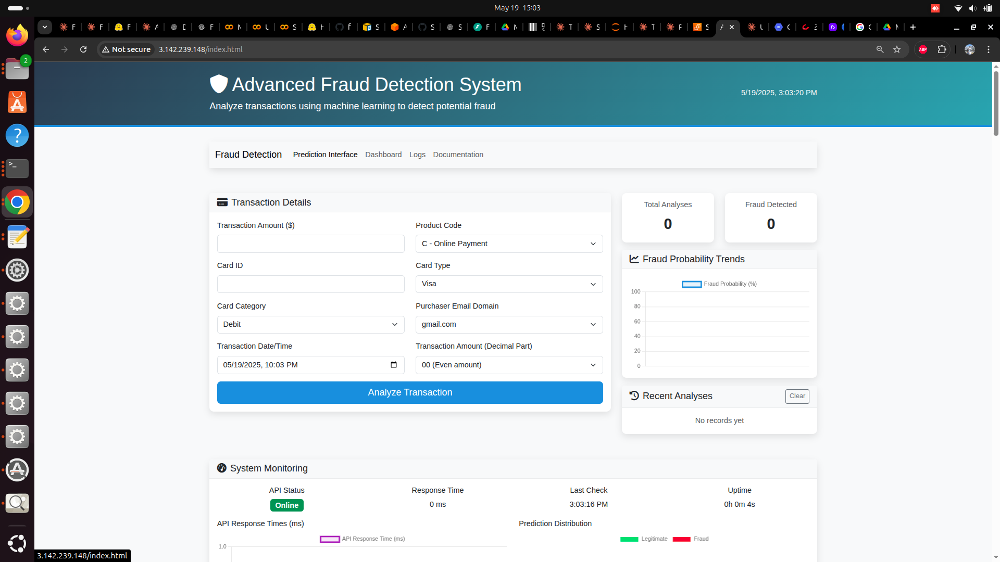

# Fraud Detection API

A machine learning API for detecting fraudulent transactions. This system uses a Random Forest classifier trained on transactional data to identify potentially fraudulent activities.



## Features

- **Advanced ML Model**: Trained on transaction data to detect fraudulent patterns
- **Real-time API**: Fast response times for immediate fraud assessment
- **Interactive UI**: User-friendly interface for submitting transactions and visualizing results
- **Monitoring Dashboard**: Track system performance and fraud metrics
- **Comprehensive Logging**: Detailed logs for all system events

## Installation

### Prerequisites

- Python 3.8+
- pip
- Docker (optional)

### Option 1: Local Installation

1. Clone the repository:
   ```bash
   git clone https://github.com/bradkim1/fraud-detection-api-ec2.git
   cd fraud-detection-api-ec2


**Training Dataset train_transaction.csv
   - This needs to be unzipped when needed for model training

## Large File Not Included in Repository

This repository does not include the following large file due to GitHub size limitations:


1. **Miniconda Installer**:
   - Not required for running the application
   - If needed, download from https://docs.conda.io/en/latest/miniconda.html
  
     
Fraud Detection API project follows this structure:

All other files which were committed but not on the structure were used for test purpose

    model-ec2/
    ├── model/                    # Trained model and pipeline files
    │   ├── model.pkl             # Serialized machine learning model
    │   ├── pipeline.pkl          # Preprocessing pipeline
    │   └── pipeline_module.py    # Helper module for using the pipeline
    ├── fraud-ui/                 # Web interface files
    │   ├── index.html            # Main prediction interface
    │   ├── dashboard.html        # Monitoring dashboard
    │   └── logs.html             # Log viewer
    ├── docs/                     # Documentation
    │   ├── source/               # Documentation source files
    │   └── build/                # Generated documentation
    ├── notebooks/                # Jupyter notebooks
    │   └── fraud_model_training.ipynb # Model training notebook
    ├── logs/                     # API logs
    ├── nginx/                    # Nginx configuration
    ├── enhanced_fraud_api.py     # API implementation
    ├── requirements.txt          # Python dependencies
    ├── Dockerfile                # Docker configuration
    ├── docker-compose.yml        # Docker Compose configuration
    └── README.md                 # Project documentation
